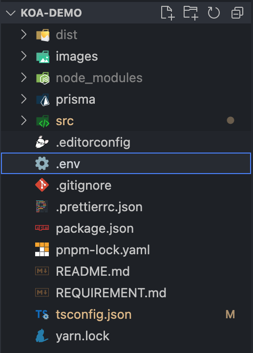
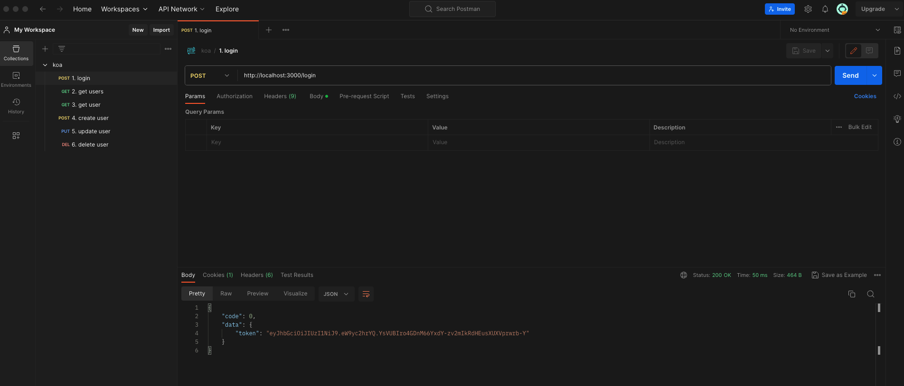

# Koa RESTful API demo

this project is a implementation demo which meets the requirement described in `REQUIREMENT.md`.

## Introduction

this is a node.js RESTful api server built by koa + typescript + prisma.

it contains:

- a set of `CRUD` method for single entity: user
- an api to query multiple users.
- a `login` api to get the jwt token.

## API description

we support 6 apis at this project. five for entity CRUD and one for login(to get jwt token)

### login

- method: `POST`
- url: /login
- params:

```
//
loginRequest {
  name String required // any string will be ok
}
```

---

### get users

- method: `GET`
- url: /users
- params:

```json
// query
?name=xxx&mail=xxx
```

---

### get user

- method: `GET`
- url: /users/:userId
- params: none

---

### create user

- method: `POST`
- url: /users
- params:

```
createRequest {
  name String required
  email String required // should be valid email format.
  password String required
}
```

---

### update user

- method: `PUT`
- url: /users
- params:

```json
updateRequest {
  id String required
  name String optional
  email String optional
  password String optional
}
```

---

### delete user

- method: `DEL`
- url: /users/:userId
- params: none

## Start

### installation

run `pnpm i` or `yarn` to install the node_modules of this project.

### env config

we put important data in `.env` file which is stored locally and will not be uploaded to git.

the `.env` file will be sent **by email**.

after receiving the `.env` file, put it at the root of project like below:



### initialize db

we use [prisma](https://www.prisma.io/docs/getting-started) as the ORM lib in this project. before running your server, you should generate the `prismaClient` and `initialize the db(optional)`.

by generating prismaClient, run:

```
pnpm prisma generate
```

> !IMPORTANT: every time you changed the `prisma.scheme`, you should regenerate the prismaClient.

by initializing the db, run:

```
pnpm prisma migrate --name init
```

> !IMPORTANT: since we have already migrated the verceldb to sync with our prisma scheme, this step can be skipped.

we use a [vercel PostgreSQL](https://vercel.com/dashboard/stores) in this project. the verceldb is free but limited, so there may be updates if we run out of the resource in verceldb.

Updating will be made by change the `.env` file.

### start the server

after doing the above procedures, now you can launch the server by running:

```
pnpm dev
```

or

```
yarn dev
```

## test api

I use `Postman` to test api.

in `resource` folder there is a postman config which is exported by me. you can import this config into postman to test the `6` apis supported by this server.


